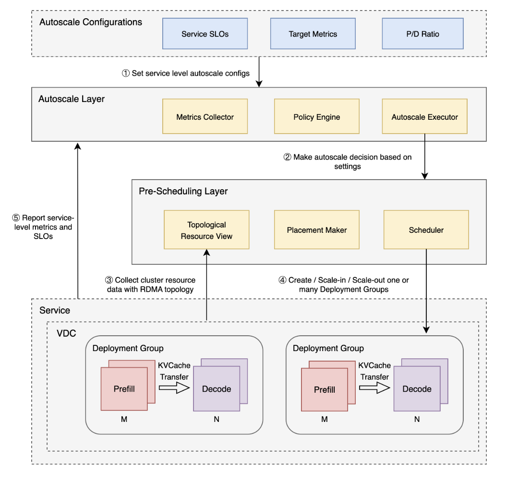
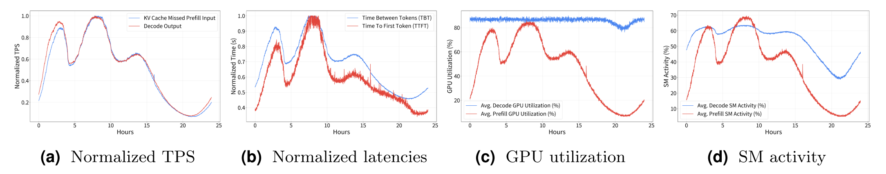
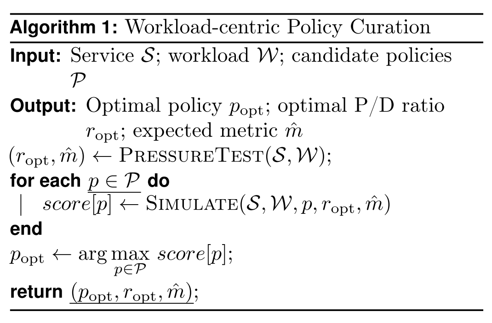
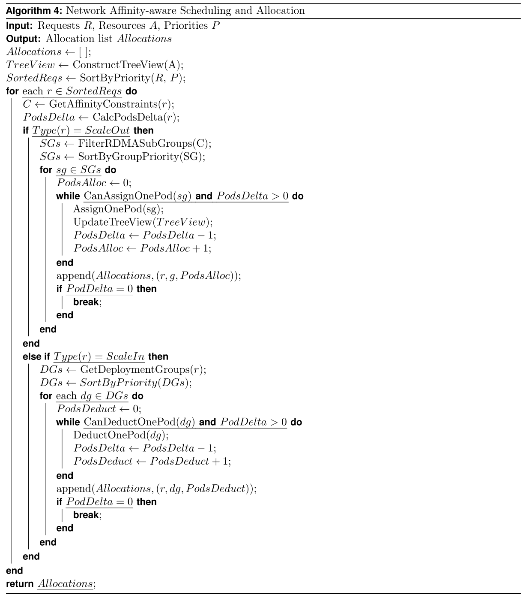
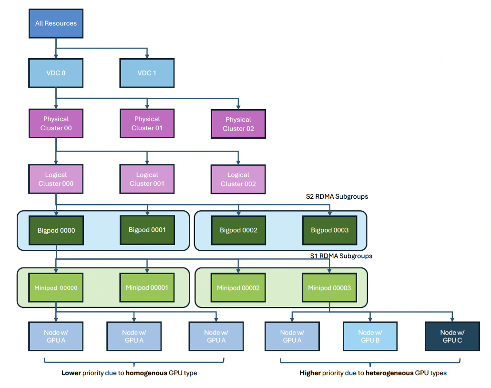

# 文章信息

1**ByteDance Seed**, 2National University of Singapore, ∗Equal contribution

## 摘要

arxiv2508

Rongzhi Li1,2,∗, Ruogu Du1,∗, Zefang Chu1,∗, Sida Zhao1, Chunlei Han1, Zuocheng Shi1, Yiwen Shao1, Huanle Han1, Long Huang1, Zherui Liu1, Shufan Liu1

Serving Large Language Models (LLMs) is a GPU-intensive task where traditional autoscalers fall short, particularly for modern Prefill-Decode (P/D) disaggregated architectures. This architectural shift, while powerful, introduces significant operational challenges, including inefficient use of heterogeneous hardware, network bottlenecks, and critical imbalances between prefill and decode stages. We introduce HeteroScale, a coordinated autoscaling framework that addresses the core challenges of P/D disaggregated serving. HeteroScale combines a topology-aware scheduler that adapts to heterogeneous hardware and network constraints with a novel metric-driven policy derived from the first large-scale empirical study of autoscaling signals in production. By leveraging a single, robust metric to jointly scale prefill and decode pools, HeteroScale maintains architectural balance while ensuring efficient, adaptive resource management. Deployed in a massive production environment on tens of thousands of GPUs, HeteroScale has proven its effectiveness, increasing average GPU utilization by a significant 26.6 percentage points and saving hundreds of thousands of GPU-hours daily, all while upholding stringent service level objectives.

服务大型语言模型（llm）是一项gpu密集型任务，传统的自动缩放器在这方面做得不够，特别是对于现代的prefill - decode （P/D）分离架构。这种架构的转变虽然强大，但也带来了重大的操作挑战，包括异构硬件的低效使用、网络瓶颈以及预填充和解码阶段之间的严重不平衡。我们介绍了HeteroScale，一个协调的自动扩展框架，解决了P/D分解服务的核心挑战。HeteroScale结合了拓扑感知调度器，该调度器可适应异构硬件和网络约束，并结合了一种新的度量驱动策略，该策略源自对生产中的自动缩放信号的首次大规模实证研究。通过利用一个单一的、健壮的度量来联合扩展预填充和解码池，HeteroScale在确保高效、自适应的资源管理的同时保持了架构平衡。在数万个GPU的大规模生产环境中部署，HeteroScale已经证明了它的有效性，平均GPU利用率显著提高了26.6个百分点，每天节省了数十万个GPU小时，同时保持了严格的服务水平目标。

<!-- more -->

P/D分解将计算密集型的预填充阶段与内存受限的解码阶段分开，从而允许独立优化。虽然这提高了效率，但它引入了三个相互关联的大规模扩展和调度挑战

- Heterogeneous Hardware Inefficiency。 Prefill和Decode阶段对硬件资源的需求不同,不考虑这种差异的同构集群每生成token的成本增加41%，且存在资源碎片。 
- Network Bottlenecks。 KVCache的传输是高吞吐带宽密集操作，如果将网络资源视为扁平的无差异的网络进行随意放置会导致KVCache的传输带宽减小20%。从而导致延迟增加，成为性能瓶颈。
- Architectural Imbalance。 保持最优比例的PD分离可以防止成为另一阶段的瓶颈，但是如果根据GPU利用率作为HPA（Horizontal Pod Autoscaler，K8S的标准自动缩放策略）的输入判断，效率并不高，因为Decode阶段的GPU利用率是一个误导性指标，由于KVCache的存在 通常居高不下。

本文推出HeteroScale：一个用于P/D分离的LLM服务的自动缩放系统，它包含以下三个部分

- A Framework for Heterogeneous Resource Management 异构资源管理框架
- Novel Abstractions for Network-Aware Scheduling. 网络感知调度的新抽象
- A Comprehensive Analysis of Scaling Policies with Production Data 基于生产数据的规模策略综合分析

# 背景&相关工作

**P/D Disaggregated Serving PD分离的推理服务**

大型语言模型推理由预填充（prefill）和解码（decode）两个不同的阶段组成，这两个阶段具有自己的计算需求和操作行为特征。
预填充阶段，该模型并行处理整个输入提示，一次性为所有输入令牌构建KV缓存。解码阶段的操作是自回归的，每次生成一个令牌，同时依赖于先前创建的KV缓存。

从计算的角度来看，预填充是高度计算密集型的，并受益于大量的并行性，而解码本质上是顺序的，对原始计算能力的要求较低。它们的内存使用也不同:预填充的内存占用随着输入提示符的长度而增长，而解码的内存需求随着累积KV缓存的大小而增加。在批处理效率方面，预填充可以充分利用大型、同构的批处理来最大化吞吐量，但是解码由于每一步只能产生一个令牌，从批处理中获得的收益要少得多，并且很快就会受到内存限制。

此外，这两个阶段对延迟的影响不同:预填充决定初始响应延迟(Time-To-First-Token, TTFT)，而解码决定令牌生成速度(timebetween - token, TBT)\[3,4\]。
> TTFT:从用户发送完整请求（prompt）到模型开始返回第一个令牌（token）所花费的时间。  
TBT:模型在输出阶段，生成两个连续令牌（token）之间的平均时间间隔。

P/D分离服务将这些阶段分配到不同的实例集上，使每个实例都可以独立优化。这种分离通过允许单独供应预填充和解码节点(即使是在异构硬件上)来提高资源利用率，以便更好地匹配它们不同的计算和内存需求。它还提高了批处理效率，因为预填充和解码节点对批处理大小有不同的约束。

# 挑战&关键Insight

## Motivation

- Hardware Heterogeneity  GPU硬件异构，有很多种类型

- Hierarchical Network Topology   在分层网络中要考虑PD传输最小化时延，必须进行拓扑感知
    网络体系结构是明确的分层结构，由本地交换机(S0)下的多台机器组成，这些机器被聚合为mini Pod(S1)和BigPod(S2)。此拓扑对于P/D分类服务至关重要，在这种情况下，大型KV缓存的传输需要网络感知放置以最大限度地减少延迟。

- Co-location and Grouping Abstractions 绑定分配和分组抽象。Deployment Group 部署组,绑定了不同的服务角色（P or D）使得其必须共享相同的域，如在同一交换机下，不跨层调度。虽然Deployment Group中的角色可以独立伸缩，但这种抽象产生了复杂的调度相互依赖关系。这些特征，如硬件异构性、严格的网络拓扑结构以及对PD分离的协调扩展的需要，在指标选择和资源管理方面产生了实际挑战，从而激发了异构规模的设计。
>  Co-location 应该理解成 这些部署组本身应该是绑定关系 在实际部署时不能拆分 存在拓扑依赖关系  
Grouping Abstractions  并不是很理解 暂时理解为 该部分是指如何根据这种分组关系，提取反应组状态的指标同时根据指标进行管理

## 挑战

**Challenge 1: Scheduling with constraints. 有约束的调度**

预填充和解码工作程序在异构硬件上操作，因为它们主要影响不同的性能指标——预填充的TTFT和解码的TBT，所以具有不同的SLO优先级。

工作负载特征的变化，包括模型选择、提示长度和响应长度，可以改变两个阶段之间的需求分布。

这种不平衡可能会导致一个池中的资源未得到充分利用，而在另一个池中造成瓶颈，从而使它们之间的协调扩展成为一项非常重要的任务。

此外，P/D分解引入了强网络亲和约束:预填充和解码节点必须有效地交换大KV缓存数据，即保证传输带宽。

调度必须考虑多个约束，在保持池间容量平衡的同时减少节点间通信的开销。

**Challenge 2: Heterogeneous resource management. 异构资源管理**

集群由高度异构的资源组成，包括不同代的GPU、内存容量、计算能力和互连带宽。在这些集群上运行的服务同样多样化。

一些依赖于同构硬件池，而另一些则需要异构配置。在这种混合环境中协调分配是具有挑战性的。

首先，可能会出现伸缩冲突，例如当异构和同构服务共享相同的硬件池时，它们之间的资源争用。

其次，不匹配的位置(服务与其最佳硬件不一致)可能导致性能下降、容量浪费和碎片增加，最终降低整体效率。

**Challenge 3: Metric selection. 指标选择**

在传统的自动缩放系统中，比如Kubernetes的Horizontal Pod Autoscaler (HPA)，决策通常是由GPU利用率等粗粒度指标驱动的。然而，在P/D分离的大型语言模型中，这些指标可能会产生误导。例如，解码节点可能显示出高GPU利用率，尽管由于KV缓存压力在低工作负载下运行。

这需要更深入地研究能够更好地捕获每个池的真实工作负载和性能特征的指标。

**Challenge 4: Large-scale production environment. 大规模生产环境**

考虑到生产环境的性质，跨越数万个gpu，每天处理数万亿个Token，一个实用的解决方案应该是高度可扩展的，能够处理各种操作需求。它必须兼容各种类型的服务，并支持不同的部署模式，包括通用部署、P/D分分离和分离的MoE服务，同时容纳异构资源。此外，设计应保持低维护成本，确保在动态工作负载下的高可靠性。

# 解决方案&思路

## System Design
<figure align="center">

<figcaption>HeteroScale System Architecture</figcaption>
</figure>

## System Architecture

HeteroScale旨在解决自动缩放P/D分解大型语言模型服务的独特挑战。该系统由三个主要层组成:

**带策略引擎的自动伸缩层（Autoscaling Layer with Policy Engine）** ：提供配置验证、存储、API、指标收集和各种策略，用于制定扩展和扩展决策。

**联邦预调度层(Federated Pre-Scheduling Layer)** ：执行伸缩决策，负责管理资源分配、组装拓扑资源视图和调度部署组。该层与底层基础设施接口以实现伸缩操作，包括伸缩现有资源或创建具有指定P/D比率的部署组批次。

**子集群调度层 (Sub-cluster Scheduling Layer)** ：所有源自预调度层的部署组的扩展、创建和删除都通过该层进行委托，该层将调用传播到底层Kubernetes API服务器，在那里创建或更新相应的crd。同时，该层公开节点API，并向上提供用于拓扑组装的API。

这些层通过定义良好的接口进行通信，从而允许模块化开发和测试。监视组件向策略引擎提供反馈，从而创建一个闭环控制系统，该系统可以不断适应不断变化的工作负载条件。

## Autoscaling Layer with Policy Engine

自动扩展框架集成了配置管理和策略引擎功能，为自动扩展决策提供了一个整体解决方案。配置管理模块使后端工程师和操作人员能够根据所需的slo和性能目标定义生产服务参数。同时，策略引擎定期跨服务评估这些配置，利用实时度量观察来执行缩放操作。

## Scaling Policies

自动伸缩P/D分离服务的主要挑战之一是在动态负载下保持架构平衡。孤立地扩展一个组件可能会遇到瓶颈，从而破坏分离效果。

因此，HeteroScale的策略引擎不仅可以调整容量，还可以作为相互依赖的预填充和解码阶段的协调编排器。

我们实现了两个提供互补控制策略的策略范例:用于可预测的粗粒度调整的周期性策略，以及用于细粒度实时优化的指标驱动策略。

这些策略将高级服务目标转换为具体的扩展操作，从而保持跨异构硬件的关键P/D比率。此外，我们还为策略管理开发了一个工作负载感知框架。

**Periodic Scaling Policy** 周期性扩展策略

周期性扩展策略基于时间模式调整资源，支持基于预期工作负载模式的主动扩展。此策略对于具有可预测流量模式(如昼夜周期或每周模式)的服务是有益的。

通过根据具有静态目标实例和P/D比率的周期定义scaleing计划，可以将预期的资源自动分配给目标服务。

在生产环境中，对于在特定约束下运行的服务或涉及实验性配置的服务采用周期性扩展，这些服务不支持指标驱动的扩展策略。(***why?***)

**Metrics-driven Scaling Policy** 指标驱动的扩展策略

虽然传统的自动缩放器通常默认使用硬件利用率，但调查显示，此类指标在P/D分离环境中可能会产生误导。这就需要对一个Metric进行原则性的实证研究，该指标可以作为系统整体健康和负载的鲁棒代表。

一个可行的指标不仅要跟踪高信噪比的负载压力，而且要普遍适用于各种型号和硬件。如果不能识别正确的信号，将导致不稳定和资源浪费。为了描述P/D分离的服务堆栈，我们将候选指标分为三类:

- Throughput: Prefill and decode TPS;

- Hardware: Prefill/decode GPU SM activity and GPU utilization \[1, 2, 6\];

- Latency: TTFT and TBT \[3, 4\].

We used metric traces from an open-domain dialogue service with hundreds of GPUs for preliminary verification.

<figure align="center">

<figcaption>Metrics</figcaption>
</figure>

To demonstrate that these insights are modality-agnostic, we repeated the study on a vision-language search service; the results appear in the appendix (Figure 8). The same qualitative patterns hold for other workloads such as web search, long-form content understanding, real-time audio conversation, real-time video processing, and code generation.

***Throughput Metrics Analysis***

我们发现吞吐量指标在高峰和非高峰期间显示出显著差异，具有高信噪比，准确地反映了服务负载条件,如图Metrics(a)所示。这些指标可以快速响应流量变化，实现及时的扩展操作。由于KV缓存命中率的干扰，缓存下的预填充TPS测量对于自动缩放来说是不可靠的，因此只考虑"KV缓存 missed 预填充 TPS" 和 解码TPS 。(**为什么不可靠？**)

***Hardware-level Metrics Analysis***  硬件层面的指标呈现出明显的极化:

Prefill阶段实例的硬件指标(如Prefill GPU利用率和SM活动)对具有高信噪比的负载变化做出敏感响应，而Decode阶段硬件指标(如解码GPU利用率和SM活动)即使在轻微压力下也保持高值。对负载变化的敏感性较低(Metrics(c), Metrics(d))。

这种差异源于两个阶段的不同特征。预填充阶段是计算密集型的，因此其硬件利用率与负载呈线性相关。相比之下，解码阶段是内存受限的，其大部分利用率来自KV缓存存储和数据传输操作。这些内存操作使硬件级指标始终保持在高水平，而不考虑工作负载的适度下降，从而使它们对实际负载变化的敏感性大大降低。

***Latency Metrics Analysis***

TTFT和TBT 捕捉工作负载压力，但反应方式明显是非线性的(Metrics(b))。当工作负荷较低时，两条曲线几乎保持平坦;一旦负载移动到较高的一端，它们就会突然上升。这种断崖式的过渡使得仅从延迟无法按比例缩放资源，而是需要负反馈控制器。在这两者中，TBT提供了更清晰的信号，而TTFT的信噪比较低，限制了其作为主要自标度指标的有效性。

从上面的分析中可以看出一个清晰的模式:吞吐量和硬件级指标随着资源分配的变化而成比例地、可预测地变化，而延迟指标则表现出非线性的、阈值驱动的行为。

这种二分法需要一种混合的政策方法，而不是一刀切的解决方案。相反，我们需要一种混合的方法——一种利用线性度量的比例控制和非线性度量的负反馈机制的方法。在这种见解的指导下，我们设计了两种互补的缩放算法，它们共同构成了HeteroScale稳定高效的自动缩放框架的基础。完整的算法详见附录B。

#######这一部分尝试分析不同的Metrics的特点 以及能否作为策略的输入以及如何作为策略的输入来进行下一步扩缩容的判断#####

***Proportional Control for Linear Metrics*** 线性度量的比例控制

这里的关键创新是它以协调的方式应用:

来自一个组件(例如解码TPS)的缩放信号用于计算预填充和解码池所需的容量，严格执行目标P/D比。这将简单的算法转换为维护体系结构完整性的强大机制。

系统根据每个实例的目标度量计算所需的总容量。然后，它应用P/D比率来确定每个角色的最终实例计数，防止因独立扩展它们而产生的不稳定性。

***Negative Feedback for Non-Linear Metrics*** 非线性指标的负反馈

对于高度非线性的、类似悬崖的指标，如延迟(TTFT和TBT)，比例响应将是危险的不稳定，导致严重的过度供应和振荡。在这里，我们采用更为保守的负反馈策略。这种方法作为一种安全机制，而不是主要的缩放驱动程序。它使用多层阈值系统，仅在slo有被破坏的风险时触发固定的、增量的调整。例如，中等延迟增加会触发一个小的、固定百分比的扩展事件(例如，10%)，而严重的泄露会触发一个更大、更紧急的响应(例如，20%)。这种谨慎的、基于步骤的方法防止系统对延迟的不稳定行为反应过度，提供了一个重要的稳定层，补充了主要的比例策略。

## Workload-centric Policy Curation 以工作负载为中心的策略管理

<figure align="center">

<figcaption>算法1</figcaption>
</figure>

在HeteroScale中，自动扩展遵循以工作负载为中心的Pipeline(算法1)。它首先进行压力测试，给定服务及其工作负载概况，确定最佳P/D比率，并估计负载下的预期性能指标。接下来，在这些基准条件下模拟每个候选缩放策略以评估其有效性。最后，系统选择使所选目标最大化的策略(例如，在保持SLO遵从性的同时实现吞吐量)。

在我们的生产平台上，解码TPS是我们生产平台上的主要缩放指标。

On our production platform, decode TPS serves as the primary scaling metric on our production platform.

A comprehensive evaluation presented in Section 4 highlights the effectiveness and limitations of the aforementioned real-time metrics for scaling P/D-disaggregated services.

## Federated Pre-Scheduling Layer

联邦预调度层提供GPU资源的高级视图，并做出调度决策。它负责将策略引擎中的"缩放什么"决策转换为物理基础设施上的"何处放置" 决策。

这是通过异构资源管理框架和考虑服务需求和全局集群效率的网络亲和性感知调度算法实现的。此调度过程的详细逻辑可在附录B中找到。

- Heterogeneous Resource Management Framework  异构资源管理框架

    HeteroScale实现了一个能够高效地分配和管理各种GPU资源的异类资源管理框架。  
    该算法考虑了资源请求、按类型划分的可用资源、服务优先级和资源约束。它按优先级对请求进行排序，并尝试为每个请求分配首选资源。如果首选资源不可用，它会尝试其他兼容资源。
    算法如下图所示
    <figure align="center">
    
    <figcaption>算法4</figcaption>
    </figure>

- Deployment Group Abstraction for Network Affinity  网络感知的部署组抽象 
    在P/D分类服务中，性能严重依赖于连接PD的网络链路的延迟和带宽，因为该链路承载KVCache。为了最小化该通信开销，实例通常必须位于高速互连的网络域内，例如在公共聚合交换机(例如，S2)下。  
    HeteroScale引入了部署组抽象并具有以下特征:
    - Shared Scheduling Domain 共享调度域 也就是尽可能在同一个tor交换机下或Spine内  没有这个要求的任务可以放宽到集群内
    - Independent Scaling Roles PD独立部署 可以根据比例 分别向外/内扩展  

    这一方法不仅基于可用容量，还受到底层硬件资源的优先级的指导。  
    例如，系统可以选择在较低优先级的资源池中创建新的部署组，以便为更关键的工作负载节省现有组的域内的高优先级资源。  
    这种智能放置可防止服务因本地资源耗尽而成为瓶颈，同时还可实现对接近网络的宝贵硬件进行基于优先级的全局优化。
- Prioritizing Resources with RDMA Subgroups 
    为了防止具有松散亲和性要求的服务消耗这些高级资源，HeteroScale引入了优先级系统，它是S1或S2交换机的逻辑集合，如图3所示。
    <figure align="center">
    
    <figcaption>Topological resource tree</figcaption>
    </figure>
    
    - 低优先级：S2同构GPU子组。这些交换机包含S2交换机，其中所有底层GPU都属于单一类型。它们是最常见的资源配置，适用于最广泛的服务
    - 中优先级：S2异构GPU子组。在这些子组中，一台S2交换机管理多种GPU类型，但其每台底层S1交换机保持同构。这允许在S2域内实现硬件专门化。
    - 高优先级：S1异构型GPU子组。这些是最有价值的池，包含直接连接不同GPU类型的计算机的S1交换机。它们使要求最苛刻的异构P/D配置具有尽可能紧密的网络亲和性。

- P/D Ratio Maintenance 保持最佳比例
    In the online environment, we use a fixed P/D ratio for scaling. 一个固定的 来自实际经验的比例进行设置。  
    P/D比率的计算和维护过程考虑了当前预填充和解码实例的数量、目标P/D比率、缩放阈值和历史工作负载数据。  
    它首先计算当前的配比，并检查是否需要根据阈值进行调整。如果需要调整，它会根据工作负载数据计算最佳实例计数，并应用平稳过渡以避免突然更改。预填充和解码实例始终同时放大或缩小。这种方法旨在防止在预填充或解码实例分别成功扩展后，另一个实例因资源不足而无法扩展的情况，从而避免P/D比不平衡的问题。  
    然而，在某些情况下，同时伸缩预填充和解码实例也可能导致P/D比失衡。  
    例如，在创建了固定P/D比的新部署组后，由于配置和启动策略的不同，预填充和解码实例可能会无序启动。这可能导致P/D比暂时失衡，从而影响TTFT等SLO。  
    为了解决这个问题，我们在服务框架级别增加了相应的支持：如果Ready状态的预填充和解码实例的比例明显偏离配置的比例，则数量较大的角色的服务发现将被暂停，只有在来自另一个角色的其他实例完成服务发现注册，并且Ready状态的实例恢复到可以容忍的P/D比后，才会继续注册。

- The Affinity-Aware Scheduling Algorithm   
    调度周期按如下方式进行：
    - Topology Discovery  拓扑资源树构建
    - Request Sorting   服务优先级排序  
    - Candidate Evaluation (for Scale-Out) 对于每个高优先级横向扩展请求，调度程序会识别所有有效的放置选项。这包括评估扩展服务的现有部署组和在不同的、兼容的网络域中创建新的部署组。
    - Priority-Based Selection  根据其关联的RDMA子组的优先级对每个候选放置进行评分。然后，调度器选择满足服务亲和性约束的最佳位置，同时最小化高优先级资源的消耗。例如，它会倾向于将低亲和度服务放在低优先级子组中，即使这需要创建新的部署组，从而为需要它的工作负载保留高价值硬件。
    - Virtual Allocation  一旦做出布局决策，在周期的剩余时间内，从拓扑树中虚拟地扣除所选择的资源。这种原子预留防止它们被考虑用于同一循环中的较低优先级请求。

    处理扩展请求。调度程序只需选择一个或多个服务的部署组进行扩展，尤其是那些占用高优先级资源池的，以释放它们。为了保持一致的状态，释放的资源不会立即添加回可用池；而是在下一个调度周期开始时从基础集群状态重建整个资源视图。
- Extending to Disaggregated MoE
    HeteroScale通过调整其部署组抽象用于具有不同的预填充和解码组件的服务，从而扩展到分散的MOE。预填充级本身包括注意(ATTN)和前馈(FFN)实例，由调度器共同位于高亲和力S1交换机内，而整个预填充-解码对被放置在公共S2交换机下。这种分层调度实现了双重比率控制：在预填充复制品中保持严格的抗噪比，并在预填充和解码组件之间保持比例平衡，从而确保体系结构的稳定性和性能。 
    :)所以大致的意思是 MoE是PD分离的特立 只要保证PD分离配比的情况 就能保证在两级分类（PD S1 pd扩展S2）的策略就能保证MoE的高效性

## 3.5 Sub-cluster Scheduling Layer

在预调度层发起的所有对部署组的操作都通过该组件进行路由，该组件将请求委托给Kubernetes API服务器以创建或更新相应的crd。同时，该层向上公开节点API，支持拓扑构造。对这一层的详细讨论超出了本文的范围。

## 3.6 System Stability Mechanisms
- Anti-flapping Mechanisms.  扩展和扩展之间的快速波动，通常称为摆动，可能会导致资源浪费和系统不稳定。HeteroScale通过互补机制的组合缓解了这一问题。首先，它强制实施冷却期，确保缩放操作之间的最小间隔，以防止快速振荡。滞后阈值加强了这一点，它使用不同的触发点来扩展和扩展，创建了一个促进稳定性的缓冲区。此外，抑制因素被应用来调节调整的规模，进一步使系统对不断变化的条件的反应更加顺畅。
- Disaster Recovery Measures. 系统故障或意外事件可能会中断自动缩放操作并威胁服务稳定性。种子服务平台采用了一套灾难恢复措施。一种关键机制是软伸缩，在该机制中，标识为要删除的实例将从服务发现中撤回，但仍将继续运行。在此观察期内，系统实时监测延时等SLO。如果性能保持在目标范围内，则会终止这些实例；但是，如果检测到性能下降，则会立即恢复这些实例，从而避免了与调配新实例相关的启动延迟。该平台还保留关键状态信息，以便在发生故障后能够快速恢复正常操作。最后，当资源受到限制时，它会应用优雅的降级策略，在临时减少非关键服务的同时保持基本功能。

# 实验&结论

关注性能提升 提升是如何做到的 baseline是如何选择的 选择的是否合理

模拟实验是怎么做的 用了什么方法来满足场景

# 思考与启发

# 扩展阅读

Kubernetes HPA  https://kubernetes.io/docs/tasks/run-application/horizontal-pod-autoscale/, 2023.